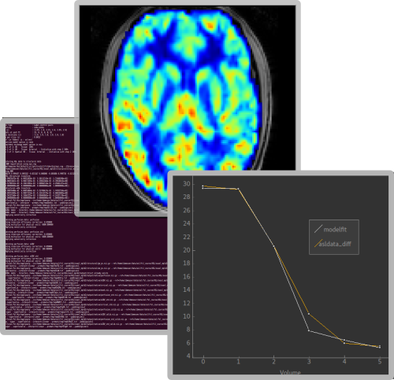

Fabber
------

Fabber is a tool for fitting timeseries data to a forward model
using a Bayesian approach. It has been designed for use with
fMRI data such as ASL and CEST, however the method is quite
general and could be applied to most problems involving fitting
discrete data points to a nonlinear model.

Bayesian nonlinear model fitting provides a more flexible alternative to
traditional linear analysis of perfusion data. 

In multi-echo or
multi-inversion-time data, this approach uses all time points to
estimate all the parameters of interest simultaneously. This can be more
accurate because it uses a detailed nonlinear model of the pulse
sequence, rather than assuming that different parts of the signal are
linearly related to each quantity of interest.

.. note::
   If you want to process ASL data you should look at the
   `OXASL <https://oxasl.readthedocs.io/en/latest/>`_
   pipeline which uses Fabber as it's model fitting tool.
   Similarly if you have CEST data, the FSL 
   `Baycest <https://fsl.fmrib.ox.ac.uk/fsl/fslwiki/baycest>`_ 
   tool uses Fabber.
   The FSL  `Verbena <https://verbena.readthedocs.io>`_ 
   tool uses Fabber to process DSC data.

To make this analysis technique fast enough for routine use, we have
adapted an approximate method known as Variational Bayes (VB) to
work with non-linear forward models. Experimentally we have found
that these calculations provide nearly identical results to sampling
methods such as MCMC and require only a fraction of the computation time
(around a minute per slice).

Fabber has a modular design and new nonlinear forward models
can be incorporated into the source code. Models have been developed
for ASL, CEST, DSC, DCE and dual echo fMRI data.

Fabber is distributed as part of `FSL <https://fsl.fmrib.ox.ac.uk/fsl/fslwiki>`_, 
however you should ensure that you are using **FSL v6.0.1 as a minimum version**.

A GUI tool for processing ASL, CEST and (soon) DSC and DCE data using Fabber
is `Quantiphyse <https://quantiphyse.readthedocs.io/en/latest/>`_.

.. toctree::
   :maxdepth: 1
   :caption: Contents:
  
   theory
   getting
   building
   running
   priors
   models
   
**Referencing Fabber**

If you use fabber in your research, please make sure that you reference
at least Chappell et al 2009 [1]_, and ideally [2]_ and [3]_ also.

.. [1] *Chappell, M.A., Groves, A.R., Woolrich, M.W., "Variational Bayesian
   inference for a non-linear forward model", IEEE Trans. Sig. Proc., 2009,
   57(1), 223–236.*

.. [2] *Woolrich, M., Chiarelli, P., Gallichan, D., Perthen, J., Liu, T.
   "Bayesian Inference of Haemodynamic Changes in Functional ASL Data",
   Magnetic Resonance in Medicine, 56:891-906, 2006.*

.. [3] *Groves, A. R., Chappell, M. A., & Woolrich, M. W. (2009). "Combined
   spatial and non-spatial prior for inference on MRI time-series."
   NeuroImage, 45(3), 2009.*\ doi:10.1016/j.neuroimage.2008.12.027\ *.*
