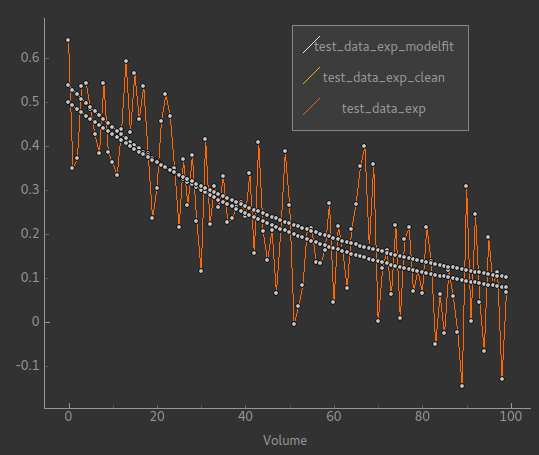
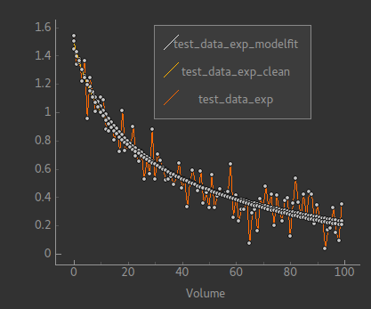
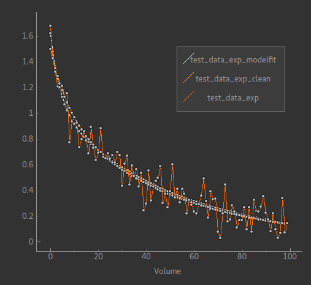

Building a new model
====================

For most new applications, a model will need to be constructed. This will
include adjustable parameters which Fabber will then fit.

A complete example model is provided in the ``examples`` subdirectory of
the Fabber source code. This provides an easy template to implement a
new model. In the next section we will go through this example.

We will assume only some basic knowledge of ``C++`` for this example.

A simple example
----------------

To create a new Fabber model it is necessary to create an instance of
the class ``FwdModel``. As an example, we will create a model which fits the
data to sum of exponential functions, each with an amplitude and decay rate.

.. math::
    \sum_n{A_n\exp(-R_nt)}

.. note::
    The source code and ``Makefile`` file for this example are in the
    Fabber source code, in the ``examples`` subdirectory. We will assume you
    have this to hand as we go through the process!

First we will create the interface ``fwdmodel_exp.h`` file which shows the methods we
will need to implement::

    // fwdmodel_exp.h - A simple exponential sum model
    #pragma once

    #include "fabber_core/fwdmodel.h"

    #include "newmat.h"

    #include <string>
    #include <vector>

    class ExpFwdModel : public FwdModel {
    public:
        static FwdModel* NewInstance();

        ExpFwdModel()
            : m_num(1), m_dt(1.0)
        {
        }

        std::string ModelVersion() const;
        std::string GetDescription() const;
        void GetOptions(std::vector<OptionSpec> &opts) const;

        void Initialize(FabberRunData &args);
        void EvaluateModel(const NEWMAT::ColumnVector &params, 
                        NEWMAT::ColumnVector &result, 
                        const std::string &key="") const;
 
    protected:
        void GetParameterDefaults(std::vector<Parameter> &params) const;
       
    private:
        int m_num;
        double m_dt;
        static FactoryRegistration<FwdModelFactory, ExpFwdModel> registration;
    };

We have not made our methods virtual, so nobody will be able to create a
subclass of our model. If we wanted this to be the case all the 
non-static methods would need to be virtual, and we would need to add a
virtual destructor. This is sometimes useful when you want to create 
variations on a basic model.

Most of the code above is completely generic to any model. The only parts which
are specific to our exp-function model are:

 - The name ``ExpFwdModel``
 - The private variables ``m_num`` (the number of exponentials in our sum) and
   ``m_dt`` (the time between data points).

We will now implement these methods one by one. Many of them are
straightforward. We start our implementation file ``fwdmodel_exp.cc`` as follows::

    //  fwdmodel_exp.cc - Implements a simple exp curve fitting model
    #include "fwdmodel_exp.h"

    #include <fabber_core/fwdmodel.h>

    #include <math.h>

    using namespace std;
    using namespace NEWMAT;

This just declares some standard headers we will use. If you prefer to fully qualify your
namespaces you can leave out the ``using namespace`` lines.

We need to implement a couple of methods to ensure that our model is visible to the 
Fabber system::

   FactoryRegistration<FwdModelFactory, ExpFwdModel> ExpFwdModel::registration("exp");

   FwdModel* ExpFwdModel::NewInstance()
   {
       return new ExpFwdModel();
   }

The first line here registers our model so that it is known to Fabber by
the name ``exp`` The second line is a *Factory method* used so that
Fabber can create a new instance of our model when its name appears on
the command line::

    string ExpFwdModel::ModelVersion() const
    {
        return "1.0";
    }

    string ExpFwdModel::GetDescription() const
    {
        return "Example model of a sum of exponentials";
    }

We’ve given our model a version number, if we update it at some later stage we should change the number
returned so anybody using the model will know it has changed and what version they have. There's also
a brief description which fabber will return when the user requests help on the model::

    static OptionSpec OPTIONS[] = {
        { "dt", OPT_FLOAT, "Time separation between samples", OPT_REQ, "" },
        { "num-exps", OPT_INT, "Number of independent exponentials in sum", OPT_NONREQ, "1" },
        { "" }
    };

    void ExpFwdModel::GetOptions(vector<OptionSpec> &opts) const
    {
        for (int i = 0; OPTIONS[i].name != ""; i++)
        {
            opts.push_back(OPTIONS[i]);
        }
    }

This is the suggested way to declare the options that your model can
take - in this case the user can choose how many exponentials to include in the sum
and what the time resolution in the data is. Each option is listed in the ``OPTIONS`` array which 
**ends with an empty option** (important!).

An option is described by:

 - It's name which generally should *not* include underscores (hyphen is OK as in this
   case). The name translates into a command line option e.g. ``--num-exps``.
 - An option type. Possibilities are:
    - ``OPT_BOOL`` for a Yes/No boolean
    - ``OPT_FLOAT`` for a decimal number
    - ``OPT_INT`` for a whole number
    - ``OPT_STR`` for text
    - ``OPT_MATRIX`` for a small matrix (specified by giving the filename of
      a text file which contains the matrix data in tab-separated form)
    - ``OPT_IMAGE`` for a 3D image specified as a Nifti file
    - ``OPT_TIMESERIES`` for a 4D image specified as a Nifti file
    - ``OPT_FILE`` for a generic filename
 - A brief description of the option. This will be displayed when ``--help`` is
   requested for the model
 - ``OPT_NONREQ`` if the option is not mandatory (does not need to be specified)
   or ``OPT_REQ`` if the option must be provided by the user.
 - An indication of the default value. This value is not actually used to initialize 
   anything but is shown in ``--help`` to explain to the user what the default is
   if the option is not given. So it can contain any text (e.g. ``"0.7 for PASL, 1.3 for pCASL"``.
   You should not specify a default for a mandatory option (``OPT_REQ``)

In this case we have made the time resolution option mandatory, but the number
of exponentials defaults to 1 if not specified.

This option system is a little cumbersome when there is only a couple of options, but if
you have many it will make it clear to see what they are. Most
real models will have many configuration options, for example an ASL
model will need to know details of the sequence such as the TIs/PLDs, 
the bolus duration, the labelling method, number of repeats, etc...

Options specified by the user are captured in the ``FabberRunData``
object which we use to set the variables in our model class
in the ``Initialize`` method. ``Initialize`` is called before the model 
will be used. Its purpose is to allow the model to set up any internal 
variables based on the user-supplied options. Here we capture the
time resolution option and the number of exponentials - note that
the latter has a default value::

    void ExpFwdModel::Initialize(FabberRunData& rundata)
    {
        m_dt = rundata.GetDouble("dt");
        m_num = rundata.GetIntDefault("num-exps", 1);
    }

We use the term *Options* to distinguish user-specified or default model 
configuration from *Parameters* which are the parts of the model inferred by 
the Fabber process. Next we need to specify what parameters our model
includes::

    void ExpFwdModel::GetParameterDefaults(std::vector<Parameter> &params) const
    {
        params.clear();

        int p=0;
        for (int i=0; i<m_num; i++) {
            params.push_back(Parameter(p++, "amp" + stringify(i+1), DistParams(1, 100), DistParams(1, 100), PRIOR_NORMAL, TRANSFORM_LOG()));
            params.push_back(Parameter(p++, "r" + stringify(i+1), DistParams(1, 100), DistParams(1, 100), PRIOR_NORMAL, TRANSFORM_LOG()));
        }
    }

``GetParameterDefaults`` is quite important. It declares the parameters our
model takes, and their prior and initial posterior distributions. It is always
called *after* ``Initialize`` so you can use whatever options you have set up to 
decide what parameters to include.

The code above declares two parameters named ``amp<n>`` and ``r<n>`` for each exponential
in the sum, where ``<n>`` is 1, 2, ... As well as a name, each parameter has two ``DistParams``
instances defining the *prior* and *initial posterior* distribution for the parameter. 
``DistParams`` take two parameters - a mean and a variance. At this
point we will diverge slightly to explain what these mean.

Priors and Posteriors
~~~~~~~~~~~~~~~~~~~~~

*Priors* are central to Bayesian inference, and describe the extent of our belief about a parameter's
value *before we have seen any data*. 

For example if a parameter represents the T_1 value of
grey matter in the brain there is a well known range of plausible values. By declaring a
suitable prior we ensure that probabilities are calculated correctly and unlikely values 
of the parameter are avoided unless the data very strongly supports this. 

In our case we have no real prior information, so we are using an *uninformative* prior.
This has a large variance so the model has a lot of freedom in fitting the parameters and 
will try to get as close to matching the data as it can. This is reflected in the high
variance we are using (``1e6``). For the mean values, ``a`` and ``b`` are multiplicative so
it makes sense to give them defaults of ``1`` wherease ``c`` and ``d`` are additive so 
prior means of ``0`` seems more appropriate.

The second ``DistParams`` instance represents the initial *posterior*. This is the starting
point for the optimisation as it tries to find the best values for each parameter. Usually this
does not matter too much and can often be set to be identical to the prior. 

Sometimes, however, it may be helpful to give the initial posterior a more restrictive (lower) 
variance to avoid numerical instability. 

It is also possible to adjust the initial posterior on a per-voxel basis using the actual
voxel data. We will not do that here, but it can be useful when fitting, for
example, a constant offset, where we can tell the optimisation to start with a value that 
is the mean of the data. This may help avoid instability and local minima.

In general it is against the spirit of the Bayesian approach to modify the priors on the
basis of the data, and no means are provided to do this. It is possible for the user to modify 
the priors on a global basis but this is not encouraged and in general a model should try to provide
good priors that will not need modification.

We now go back to our model code where we finally reach the point where we write 
the code to calculate our model::

    void ExpFwdModel::EvaluateModel(const NEWMAT::ColumnVector &params, 
                                    NEWMAT::ColumnVector &result, 
                                    const std::string &key) const
    {
        result.ReSize(data.Nrows());
        result = 0;
        
        for (int i=0; i<m_num; i++) {
            double amp = params(2*i+1);
            double r = params(2*i+2);
            for (int i=0; i < data.Nrows(); i++)
            {
                double t = double(i) * m_dt;
                double val = amp * exp(-r * t);
                result(i+1) += val;
            }
        }
    }

We are given a list of parameter values (``params``)
and need to produce a time series of predicted data values (``result``). We
do this by looping over the parameters and adding the result of each
exponential to the output result.

The additional argument ``key`` is not required in this case. It is used
to allow a model to evaluate 'alternative' outputs such as an interim 
residual or AIF curve.

Making the example into an executable
-------------------------------------

We need one more file to build our new model into it's own Fabber executable.
This is called ``fabber_main.cc`` and it is very simple::

    #include "fabber_core/fabber_core.h"

    int main(int argc, char **argv)
    {
        return execute(argc, argv);
    }

It is also possible to build Fabber models into a shared library 
which can be loaded dynamically by any Fabber executable. We will
not do that in this example but if you're interested look at the
additional source files ``exp_models.cc`` and ``exp_models.h``
for details.

Building an executable with our new model
-----------------------------------------

The example template comes with a ``Makefile`` which can be used
to build the model library using the FSL build system. First you
need to set up an FSL build environment as described in `Building Fabber`_.
Then to build and install our new model library we can just do::

    make install

.. _Building Fabber: building.html

This creates an executable ``fabber_exp`` which installs into 
``$FSLDEVDIR/bin``. This executable contains the built-in
generic models and also our new model - you can see this by running::

    fabber_exp --listmodels
    fabber_exp --help --model=exp
    
Testing the model - single exponential
--------------------------------------

A Python interface to Fabber is available which includes a simple
self-test framework for models. To use this you will need to get
the ``pyfab`` package - see pyfab.readthedocs.io for more information
on installing this package.

Once installed a simple test script for this model might look like this
(this script is included in the example with the name ``test_single.py``::

    #!/bin/env python
    import sys
    import traceback

    from fabber import self_test, FabberException

    save = "--save" in sys.argv
    try:
        rundata= {
            "model" : "exp",      # Exponential model
            "num-exps" : 1,            # Single exponential function
            "dt" : 0.02,          # With 100 time points time values will range from 0 to 2
        }
        params = {
            "amp1" : [1, 0.5],    # Amplitude
            "r1" : [1.0, 0.8],    # Decay rate
        }
        test_config = {
            "nt" : 100,           # Number of time points
            "noise" : 0.1,        # Amplitude of Gaussian noise to add to simulated data
            "patchsize" : 20,     # Each patch is 20 voxels along each dimension
        }
        result, log = self_test("exp", rundata, params, save_input=save, save_output=save, invert=True, **test_config)
    except FabberException, e:
        print e.log
        traceback.print_exc()
    except:
        traceback.print_exc()

The test script generates a test Nifti image containing 'patches' of 
data chequerboard style, each of which corresponds to a combination
of true parameter values. As Fabber is designed to work on 3D timeseries 
data you can only vary three model parameters in each test - others
must have fixed values.

The test data is generated both 'clean' and with added Gaussian 
noise of specified amplitude. The model is then run on the noisy
data to determine how closely the true parameter values can
be recovered. In this case we get the following output::

    python test_single.py --save

    Running self test for model exp
    Saving test data to Nifti file: test_data_exp
    Saving clean data to Nifti file: test_data_exp_clean
    Inverting test data - running Fabber: 100%

    Parameter: amp1
    Input 1.000000 -> 0.999701 Output
    Input 0.500000 -> 0.500674 Output
    Parameter: r1
    Input 1.000000 -> 1.000728 Output
    Input 0.800000 -> 0.801230 Output
    Noise: Input 0.100000 -> 0.099521 Output

For each parameter, the input (`ground truth`) value is given and 
also the mean inferred value across the patch. In this case
it has recovered the parameters pretty well on average. An 
example plot of a single voxel might look like this:

The orange line is the noisy data it's trying to fit while the
two smooth lines represent the 'true' data and the model fit.
In fact for this example typically the model fit is much closer
to the true data - we have chosen this voxel as an example
so it is possible to see them separately!

Testing the model - bi-exponential
----------------------------------

Fitting to a single exponential is not too challenging  - here
we will test fitting to a bi-exponential where there are two
different decay rates. We will find that we need to improve
the model to get a better fit.

First we can modify the test script to test a bi-exponential
(``test_biexp.py`` in examples)::

    #!/bin/env python

    import sys
    import traceback

    from fabber import self_test, FabberException

    save = "--save" in sys.argv
    try:
        rundata= {
            "model" : "exp",
            "num-exps" : 2,
            "dt" : 0.02,
            "max-iterations" : 50,
        }
        params = {
            "amp1" : [1, 0.5],    # Amplitude first exponential
            "amp2" : 0.5,         # Amplitude second exponential
            "r1" : [1.0, 0.8],    # Decay rate of first exponential
            "r2" : 6.0,           # Decay rate of second exponential
        }
        test_config = {
            "nt" : 100,           # Number of time points
            "noise" : 0.1,        # Amplitude of Gaussian noise to add to simulated data
            "patchsize" : 20,     # Each patch is 20 voxels along each dimension
        }
        result, log = self_test("exp", rundata, params, save_input=save, save_output=save, invert=True, **test_config)
    except FabberException, e:
        print e.log
        traceback.print_exc()
    except:
        traceback.print_exc()

This is similar to the last test but we have set ``num-exps`` to 2 and added
parameters for a fixed second exponential curve with a faster decay rate.
If we run this we get output something like this::

    python test_biexp.py --save
    Running self test for model exp
    Saving test data to Nifti file: test_data_exp
    Saving clean data to Nifti file: test_data_exp_clean
    Inverting test data - running Fabber: 100%

    Parameter: amp1
    Input 1.000000 -> 0.633822 Output
    Input 0.500000 -> 0.309912 Output
    Parameter: r1
    Input 1.000000 -> 19693700210770313216.000000 Output
    Input 0.800000 -> -324689116576874496.000000 Output
    Noise: Input 0.100000 -> 0.150277 Output

This isn't looking too encouraging. If we examine the model fit 
against the data we find that actually most voxels have fitted
quite well:

However a few voxels have ended up with very unrealistic
parameter values. This kind of behaviour is a risk with model fitting - 
in trying to find the best solution the inference can end up 
finding a local minimum which is a long way from the true
minimum.

We will show two additions we can make to our model to improve this
behaviour.

Initialising the posterior
~~~~~~~~~~~~~~~~~~~~~~~~~~

The initial posterior is a 'first guess' at the parameter values
and can be based on the data. Fabber models can use their knowledge
of the model to make a better guess by overriding the ``InitVoxelPosterior``
method. We firstly add this method to ``fwdmodel_exp.h``::

    void InitVoxelPosterior(MVNDist &posterior) const;

Now we implement it in ``fwdmodel_exp.cc``::

    void ExpFwdModel::InitVoxelPosterior(MVNDist &posterior) const
    {
        double data_max = data.Maximum();

        for (int i=0; i<m_num; i++) {
            posterior.means(2*i+1) = data_max / (m_num + i);
        }
    }

Our implementation only affects the amplitude and sets an initial
guess so that the sum of all our exponentials is close to the
maximum data value. Note that we make the posterior means 
different for each exponential - this helps break the symmetry
of the inference problem.

Parameter transformations
~~~~~~~~~~~~~~~~~~~~~~~~~

A major reason for the failure of some voxels to fit is that
the decay rate in particular could become negative, generating
an exponential increase curve which may be so far away from the
data that it does not successfully converge back to the correct
value. In many models we want to restrict parameters to positive
values to prevent this sort of unphysical solution. One way to
do this is to use a log-transform of the parameter (i.e. assuming
the parameter takes a log-normal distribution rather than a 
standard Gaussian). We can do this by modifying ``GetParameterDefaults``
as follows::

    void ExpFwdModel::GetParameterDefaults(std::vector<Parameter> &params) const
    {
        params.clear();

        int p=0;
        for (int i=0; i<m_num; i++) {
            params.push_back(Parameter(p++, "amp" + stringify(i+1), DistParams(1, 100), DistParams(1, 100), PRIOR_NORMAL, TRANSFORM_LOG()));
            params.push_back(Parameter(p++, "r" + stringify(i+1), DistParams(1, 100), DistParams(1, 100), PRIOR_NORMAL, TRANSFORM_LOG()));
        }
    }

(we also need to add ``#include <fabber_core/priors.h>`` at the top of ``fwdmodel_exp.cc``.

With these changes we still retain some bad fitting voxels but 
fewer than previously. The output of the test script is now::

    python test_biexp.py --saveike this::
    Running self test for model exp
    Saving test data to Nifti file: test_data_exp
    Saving clean data to Nifti file: test_data_exp_clean
    Inverting test data - running Fabber: 100%

    Parameter: amp1
    Input 1.000000 -> 0.714108 Output
    Input 0.500000 -> 0.498471 Output
    Parameter: r1
    Input 1.000000 -> 4.898833 Output
    Input 0.800000 -> 4.674414 Output
    Noise: Input 0.100000 -> 0.099399 Output

So we clearly have a reduction in the number of extreme values. In this case we can't actually trust the 
self-test output because sometimes the inference 'swaps' the exponentials around making 
``amp1`` = ``amp2`` and ``r1`` = ``r2``. But viewing the model fit 
visually shows sensible fitting in the overwhelming majority of voxels:

Changing the example to your own model
--------------------------------------

To summaries, these are the main steps you'll need to take to
change this example into your own new model:

-  Edit the ``Makefile`` to change references to ``exp`` to the name of your model
-  Rename source files, e.g. ``fwdmodel_exp.cc`` -> ``fwdmodel_<mymodel>.cc``
-  Add your model options to the options list in the ``.cc`` file
-  Add any model-specific private variables in the ``.h`` file
-  Implement the ``Initialize``, ``GetParameterDefaults``, ``Evaluate`` methods for
   your model.
-  If required, implement ``InitVoxelPosterior``

